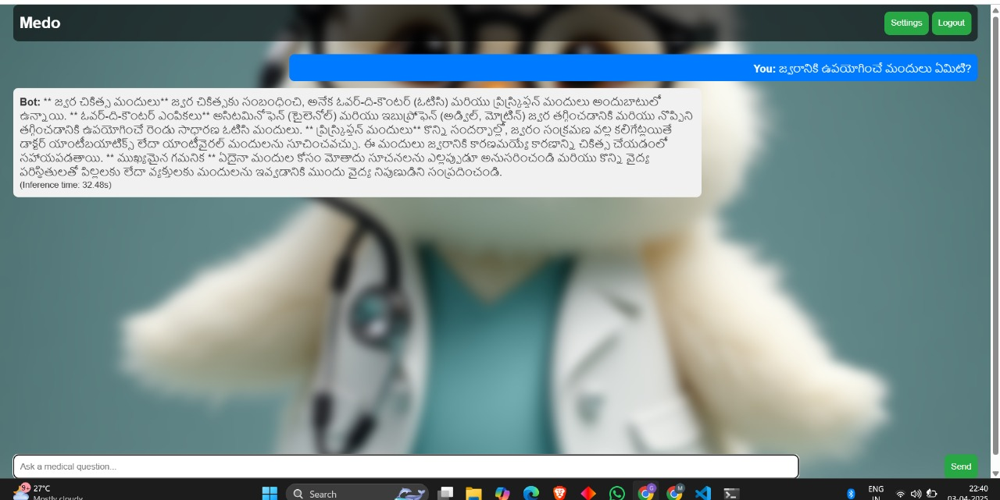
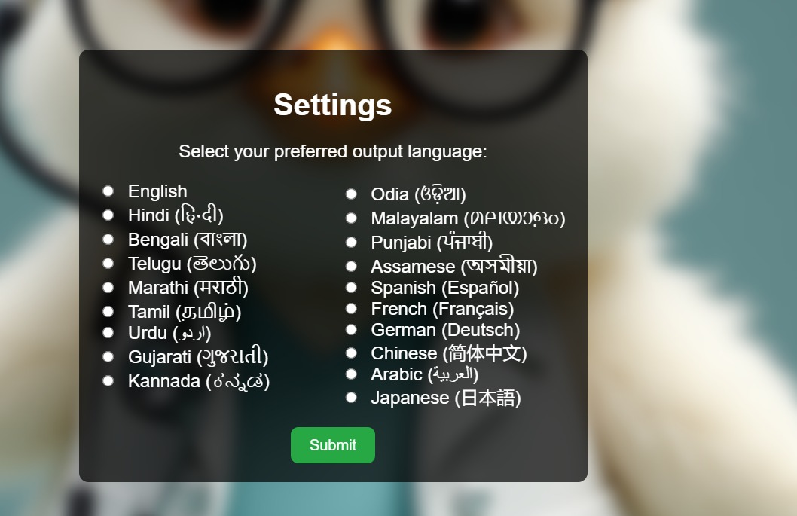

# Medo - AI Medical Assistant

Medo is an intelligent medical assistant powered by AI that provides medical information, supports multiple languages, and includes speech-to-text and text-to-speech capabilities.

## Features

### 🩺 AI-Powered Medical Assistant
- **Intelligent Responses**: Powered by Ollama's Llama 3.2 model for accurate medical information
- **Context-Aware**: Understands medical terminology and provides relevant, safe advice
- **Safety First**: Always recommends consulting healthcare professionals for serious concerns
- **Real-time Processing**: Fast response times with inference time tracking

### 🗣️ Advanced Speech-to-Text
- **Multi-Language Recognition**: Supports voice input in 6 languages
- **High Accuracy**: Powered by Google Cloud Speech-to-Text API
- **Real-time Transcription**: Instant conversion of speech to text
- **Audio Format Support**: Handles various audio formats and encodings

### 🔊 Text-to-Speech Responses
- **Natural Voice Synthesis**: High-quality audio responses using Google Cloud Text-to-Speech
- **Language-Specific Voices**: Native voice support for each supported language
- **Playback Controls**: Play/pause audio responses with toggle functionality
- **Audio Quality**: MP3 format for optimal quality and compatibility

### 🌍 Comprehensive Multi-Language Support
- **6 Languages Supported**:
  - English (en-US)
  - Hindi (hi-IN)
  - Spanish (es-ES)
  - French (fr-FR)
  - Telugu (te-IN)
  - Korean (ko-KR)
- **Automatic Translation**: Seamless translation between languages using Google Translate
- **User Preferences**: Save language preferences per user account
- **Consistent Experience**: Full UI and response translation

### 📋 Smart Prescription Management
- **AI-Powered Parsing**: Extract medication details from prescription text files
- **Calendar Integration**: Automatic medication reminders in Google Calendar
- **Structured Data**: Parse dosage, frequency, timing, and diagnosis information
- **File Upload**: Simple .txt file upload interface
- **Preview & Validation**: Review parsed data before calendar integration

### 🔍 Intelligent Web Search Integration
- **Real-time Medical Information**: Access up-to-date medical data via Firecrawl API
- **Source Attribution**: Transparent source citations for all web-based information
- **Smart Search Decisions**: AI determines when external search is needed
- **Reliable Sources**: Curated medical information from trusted websites

### 🔐 User Authentication & Security
- **Secure Login System**: Password-based authentication with encryption
- **Session Management**: Secure session handling with Flask sessions
- **User Registration**: Simple account creation with validation
- **Data Protection**: Sensitive credentials excluded from version control

### 💾 Data Management
- **User Profiles**: Persistent user data storage in Excel format
- **Language Preferences**: Individual language settings per user
- **Chat History**: Real-time chat interface with message history
- **File Handling**: Secure file upload and processing

### 🎨 Modern User Interface
- **Responsive Design**: Works seamlessly on desktop and mobile devices
- **Intuitive Chat Interface**: WhatsApp-style messaging experience
- **Visual Feedback**: Loading indicators, status messages, and error handling
- **Accessibility**: Screen reader friendly with proper alt texts and labels

### ⚡ Performance & Reliability
- **Fast Response Times**: Optimized API calls and processing
- **Error Handling**: Comprehensive error management and user feedback
- **Scalable Architecture**: Flask-based backend ready for deployment
- **Debug Information**: Optional debug mode for development and troubleshooting

## Screenshots

### Chat Interface

*Interactive chat interface showing how to communicate with Medo - ask questions via text or voice input, get AI responses with audio playback, and upload prescriptions for calendar integration*

### Language Support

*Multi-language support - Choose from English, Hindi, Spanish, French, Telugu, and Korean for both voice input and text responses*

## Demo

<!-- For GIFs or videos -->

*Live demo of voice interaction*

## Installation

1. Clone the repository:
```bash
git clone https://github.com/YOUR_USERNAME/medo-medical-assistant.git
cd medo-medical-assistant
```

2. Install dependencies:
```bash
pip install -r requirements.txt
```

3. Set up Google Cloud credentials (see Configuration section)

4. Run the application:
```bash
python app.py
```

## Configuration

Create the following credential files:
- `speech-credentials.json` - Google Cloud Speech API credentials
- `translate.json` - Google Cloud Translate API credentials
- `token.json` - Google Calendar API token
- `.env` - Environment variables

## Tech Stack

- **Backend**: Flask, Python
- **AI/ML**: Ollama (Llama 3.2), Google Cloud APIs
- **Frontend**: HTML, CSS, JavaScript
- **Database**: Excel (users.xlsx)

## Contributing

1. Fork the repository
2. Create a feature branch
3. Make your changes
4. Submit a pull request

## License

This project is licensed under the MIT License.
### Chat Interface

1. After login, you'll be directed to the chat interface.
2. Type medical questions in the chat input.
3. Receive responses from Medo, which may include real-time web search results for up-to-date information.

### Prescription Upload

1. In the chat interface, use the prescription upload feature.
2. Select a `.txt` file containing prescription details.
3. The system will parse the prescription using the LLM, extract medication details, and create calendar events for each medication.
4. View confirmation messages and any errors.

### Language Settings

1. Navigate to the settings page.
2. Select your preferred language from the dropdown.
3. Save the changes to update your language preference.

## Advanced Features

### Smart Medicine Timing Recognition

The system is designed to intelligently interpret timing instructions in prescriptions:

* **Specific Times:** Recognizes formats like "9:00 AM", "14:30", "8pm".
* **Meal-based Keywords:** Maps "breakfast" to 8:00 AM, "lunch" to 12:00 PM, "dinner" to 6:00 PM, etc.
* **Special Instructions:** Extracts and includes instructions like "before food", "after meals", etc.

### Enhanced Calendar Events

Calendar events include:
* Medication name and dosage as the event title
* Complete medication details in the event description
* Specific timing based on parsed instructions
* Popup reminder 10 minutes before the scheduled time

## Troubleshooting

* **Google Calendar Authentication:** If events aren't being created, run `python create_event.py` manually to re-authenticate.
* **LLM Issues:** Ensure Ollama is running with the correct model loaded.
* **Translation Errors:** Verify that `translate.json` has valid credentials and the API is enabled.
* **File Access:** Check permissions if encountering file not found errors.

## Security Notes

* User passwords are hashed before storage.
* Google OAuth flow follows security best practices.
* Always keep your credential files (`translate.json`, `tempCredentials.json`, `token.json`) secure.
* Change the Flask secret key from 'your_secret_key_here' in production.

## Future Improvements

* Replace Excel-based user storage with a proper database.
* Add advanced error handling and retry mechanisms.
* Implement more sophisticated user interfaces.
* Add support for additional languages and medical terminology.
* Implement more sophisticated user interfaces.
* Add support for additional languages and medical terminology.
